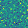

# Tensorflow GAN on MNIST Data Generation

A GAN network that generates MNIST digits data

## Code Files:
loader.py: load MNIST real images  
generator.py: a generator network with three convolutional layers    
discriminator.py: a discriminator network with two convolutional layers and two dense layers  
train.py: training the gan  
inference.py: generate MNIST images  

## Dataset:
Tensorflow Tutorial MNIST dataset  
## Result:
### Real MNIST Images  

  
### Generated MNIST Images Before Training

    
### Generated MNIST Images After Training

  
